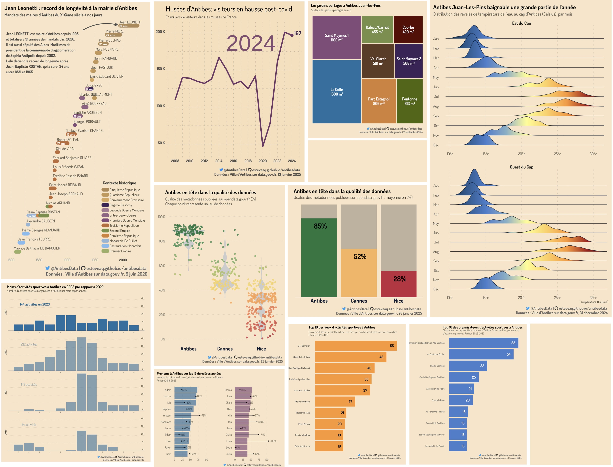

# Project

## Table of contents

-   [Introduction](#introduction)
-   [Overview](#overview)
-   [Data](#data)
-   [Visualization](#visualization)
-   [Explore](#explore)

## Introduction

This project exists to promote Open Data in the city of **Antibes Juan-Les-Pins, France** with visualizations. The goal is to encourage the publication of quality datasets. This initiative is in line with the [data.gouv.fr](https://www.data.gouv.fr/fr/) platform. Datasets are from : [Ville d'Antibes](https://www.data.gouv.fr/fr/organizations/ville-dantibes/)

## Overview

## Data

| Dataset | Description (French) |
|------------------------------------|------------------------------------|
| [Fréquentation des Musées de France](https://www.data.gouv.fr/fr/datasets/frequentation-des-musees-de-france-de-la-ville-dantibes/) | Fréquentation totale, payante et gratuite des Musées de France de la Ville d’Antibes depuis 2001. |
| [Jardins partagés](https://www.data.gouv.fr/fr/datasets/jardins-partages-a-antibes-juan-les-pins/) | Liste des jardins partagés, avec l'indication de leur capacité, situation géographique et gestionnaires. |
| [Température de l’eau de mer](https://www.data.gouv.fr/fr/datasets/temperature-de-leau-de-mer-a-antibes-juan-les-pins/) | Température de l’eau de mer relevée en deux points d’Antibes Juan-les-Pins, depuis juin 2020. |
| [Prénoms des nouveaux-nés](https://www.data.gouv.fr/fr/datasets/prenoms-des-nouveaux-nes-a-antibes/) | Prénoms des nouveaux-nés déclarés à l’état-civil à Antibes. |
| [Manifestations sportives](https://www.data.gouv.fr/fr/datasets/manifestations-sportives-a-antibes-juan-les-pins/) | Manifestations sportives organisées depuis 2019 au sein des équipements de la Ville d'Antibes. |
| [Maires de la Ville d'Antibes](https://www.data.gouv.fr/fr/datasets/maires-de-la-ville-dantibes/) | Liste des Maires d'Antibes depuis 1681 jusqu'aux élections de mars 2020 incluses. |
| [Qualité des métadonnées](https://github.com/esteveaq/antibesdata/tree/main/posts/2025-01-17/data) | Qualité des métadonnées sur data.gouv.fr pour Antibes, Cannes, Nice. |

## Visualizations

Most of the visualizations, as well as data processing and cleaning, are performed using [R](https://guides.data.gouv.fr/reutiliser-des-donnees/guide-traitement-et-analyse-de-donnees/analyser-des-donnees/analyser-des-donnees-avec-r), with `ggplot2` the `tidyverse`

## Explore

See visualizations here : <https://esteveaq.github.io/antibesdata>

 

*🇫🇷 Français*

# Projet

## Introduction

Ce projet vise à promouvoir l'open data dans la ville d'**Antibes Juan-Les-Pins** à l'aide de visualisation de données. Le but est d'encourager la publication de nouveaux jeux de données de qualité. Cette initiative s'inscrit dans la lignée de la plateforme [data.gouv.fr.](https://www.data.gouv.fr/fr/) La plupart des jeux de données sont issus de la [Ville d'Antibes](https://www.data.gouv.fr/fr/organizations/ville-dantibes/).

## Visualisations

Les visualisations, ainsi que le traitement et le nettoyage des données, sont réalisés en [R](https://guides.data.gouv.fr/reutiliser-des-donnees/guide-traitement-et-analyse-de-donnees/analyser-des-donnees/analyser-des-donnees-avec-r), avec `ggplot2` et `tidyverse`.

## Explorez

Consultez les visualisations sur notre site : <https://esteveaq.github.io/antibesdata>
