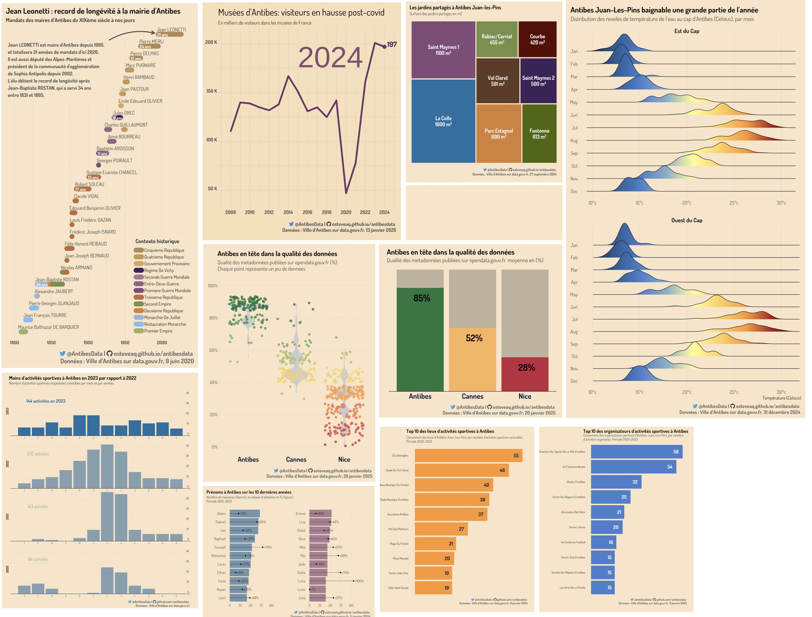

::: {.callout-note appearance="minimal"}
English
:::

# Project

## Introduction

This open data project is about promoting open data in the city of **Antibes Juan-Les-Pins** and encouraging the publication of quality datasets. My goal is to make data more enjoyable and accessible to everyone for educational and informative purposes. This initiative is in line with the [data.gouv.fr](https://www.data.gouv.fr/fr/) platform.

## Overview

## Data Processing and Visualization

Most of the visualizations, as well as data processing and cleaning, are performed using [R](https://guides.data.gouv.fr/reutiliser-des-donnees/guide-traitement-et-analyse-de-donnees/analyser-des-donnees/analyser-des-donnees-avec-r), with **ggplot2** the **tidyverse**.

## Get Involved

At this stage the contributing guidelines are not yet defined.

## Explore the Project

Explore the project and view the visualizations on our website: <https://esteveaq.github.io/antibesdata>

------------------------------------------------------------------------

::: {.callout-note appearance="minimal"}
Français
:::

# Projet

## Introduction

Ce projet open data vise à promouvoir l'open data dans la ville d'**Antibes Juan-Les-Pins** et à encourager la publication de nouveaux jeux de données de qualité. L'objectif est de rendre les données plus accessibles et à des fins éducatives et informatives. Cette initiative s'inscrit dans la lignée de la plateforme [data.gouv.fr.](https://www.data.gouv.fr/fr/)

## Aperçu

## Traitement et Visualisation des Données

La plupart des visualisations, ainsi que le traitement et le nettoyage des données, sont réalisés en [R](https://guides.data.gouv.fr/reutiliser-des-donnees/guide-traitement-et-analyse-de-donnees/analyser-des-donnees/analyser-des-donnees-avec-r), avec **ggplot2** et **tidyverse**.

## Participez

À ce stade les modalités de contribution ne sont pas encore définies.

## Explorer le Projet

Découvrez le projet et consultez les visualisations sur notre site web : Visitez le site : <https://esteveaq.github.io/antibesdata>
